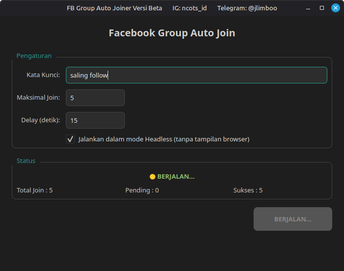
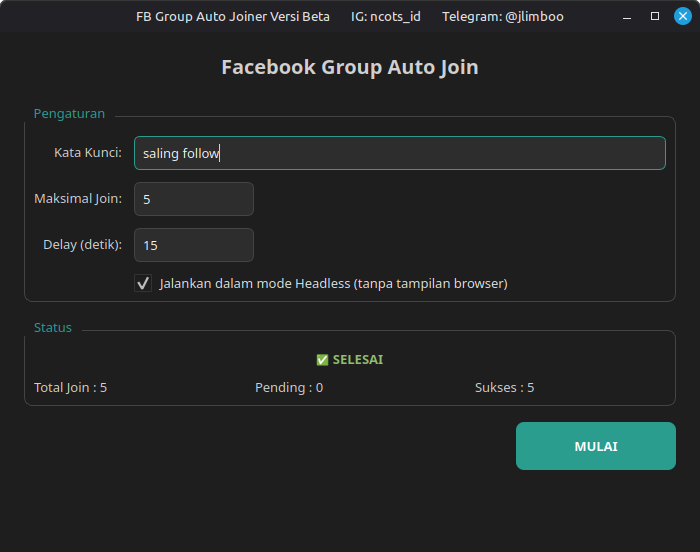
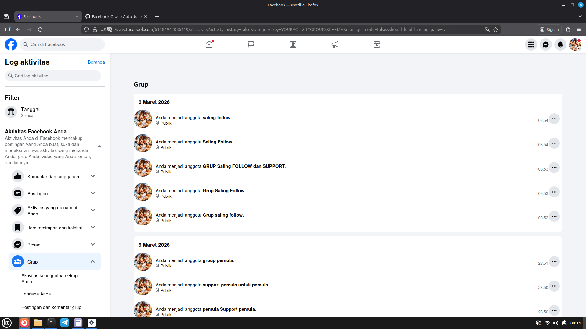

# Facebook Group Auto Joiner (GUI)

  <table>
    <tr>
      <td></td>
      <td></td>
      <td></td>
    </tr>
    <tr>
      <td align="center">Sedang berjalan - Status processing</td>
      <td align="center">Selesai - Status selesai</td>
      <td align="center">Hasil join - Di Log Facebook</td>
    </tr>
  </table>

**Versi Beta**  
Tools sederhana dengan antarmuka grafis (GUI) untuk otomatis bergabung ke grup Facebook berdasarkan kata kunci pencarian.

**Catatan Penting**  
→ Jangan Set Maximal Join Lebih Dari 20 , Maximal 10 Per Hari 

→ Delay Semakin Tinggi Semakin Bagus   
→ Harap Gunakan Akun Kecil Jangan Akun Utama  
→ Resiko Kena Checkpoint Bahkan Baned Permanen Jika Pengunaan Berlebihan

## Fitur

- Pencarian grup berdasarkan kata kunci (contoh: "motor", "kuliner jakarta", "bisnis online")
- Batas maksimal grup yang ingin di-join
- Delay antar join (untuk menghindari deteksi spam)
- Mode headless (tanpa membuka jendela browser)
- Tampilan status real-time (sukses / pending)
- Dukungan tema gelap modern (menggunakan `pyqtdarktheme`)

**Cara Ambil Cookies**
1. install extension cookie-editor
2. setelah terinstal buka cookie-editor di halaman beranda facebook kemudian pilih export terus pilih json terus copy kemudian buka file 'cookies.json' terus paste
3. simpan dan jalankan toolsnya
4. duduk santai tunggu hasil :v

## Installasi
- pip3 install -r requirements.txt
- pip install PySide6 selenium webdriver-manager pyqtdarktheme "jika ingin install module terbaru"
- run python3 main.py

